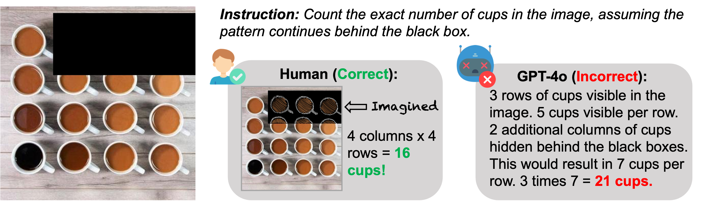

# CAPTURe Code
This repository contains the code for CAPTURe, a new benchmark and task to evaluate spatial reasoning in vision-language models, as described in the paper:
[Coming Soon](https://google.com)

by [Atin Pothiraj](https://github.com/atinpothiraj), [Elias Stengel-Eskin](https://esteng.github.io/), [Jaemin Cho](https://j-min.io/), [Mohit Bansal](https://www.cs.unc.edu/~mbansal/)

Dataset is available on [Hugging Face](https://huggingface.co/datasets/atinp/CAPTURe).
## Abstract


Recognizing and reasoning about occluded (partially or fully hidden) objects is vital to understanding visual scenes, as occlusions frequently occur in real-world environments and act as obstacles for spatial comprehension. To test models’ ability to reason about multiple occluded objects, we introduce a novel task, Counting Amodally for Patterns Through Unseen REgions (CAPTURE), which requires a model to count objects arranged in a pattern by inferring how the pattern continues behind an occluder (an object which blocks parts of the scene). CAPTURE requires both recognizing visual patterns and reasoning, making it a useful testbed for evaluating vision-language models (VLMs) on whether they understand occluded patterns and possess spatial understanding skills. By requiring models to reason about occluded objects, CAPTURE also tests VLMs’ ability to form world models that would allow them to fill in missing information. CAPTURE consists of two parts: (1) CAPTUREreal, with manually filtered images of real objects in patterns and (2) CAPTUREsynthetic, a controlled diagnostic with generated patterned images. We evaluate four strong VLMs (GPT-4o, Intern-VL2, Molmo, and Qwen2-VL) on CAPTURE, finding that models struggle to count on both occluded and unoccluded patterns. Crucially, we find that models perform worse with occlusion, suggesting that VLMs are also deficient in inferring unseen spatial relationships: even the strongest VLMs like GPT-4o fail to count with occlusion. In contrast, we find that humans achieve very little error on CAPTURE. We also find that providing auxiliary information of occluded object locations increases performance, underscoring that the model error comes both from an inability to handle occlusion as well as difficulty counting in images.

## Code Structure
```bash
occluded_scripts/
  gpt.py, intern.py, molmo.py, qwen2.py      # Model scripts
  occ_results/                               # Output results

unoccluded_scripts/
  gpt.py, intern.py, molmo.py, qwen2.py      # Model scripts
  unocc_results/                             # Output results

generate_synthetic/
  occluded_dataset/                          # Synthetic dataset generator

eval.py                                      # Evaluation script
real_dataset.zip                             # Real image dataset
real_metadata.json, synthetic_metadata.json  # Metadata
```
## Setup

### Package
```bash
pip install -r requirements.txt
```

### Code for CAPTURe dataset
Zip for CAPTURe real occluded split is included. Image names are the same as FSC-147, so the unoccluded images can be obtained by filtering from FSC-147.

Synthetic dataset generation code is included. Exact images for synthetic dataset used in this paper can be found on Hugging Face.

## Usage
Extract the real dataset by running:
```bash
unzip real_dataset_zip/real_dataset.zip -d ./
```

Or with huggingface CLI:
```bash
# to-do
```

### Running Models
Set up environment variables:
```bash
export HF_TOKEN=[insert token]
export HF_HOME=[insert desired home directory]
export AZURE_API_ENDPOINT=[insert api endpoint]
export AZURE_API_KEY=[insert key]
```
(Azure API key is only needed for GPT-4o)

Set the dataset type and model name to run any model:
```bash
# Options: occluded_scripts or unoccluded_scripts
SCRIPT_DIR=occluded_scripts        # or unoccluded_scripts
MODEL=gpt                          # gpt, intern, molmo, qwen2

cd $SCRIPT_DIR
python -m ${MODEL}.py
```
Note: If you encounter content filtering issues with GPT-4o, you may need to adjust the content filter settings in your Azure OpenAI service configuration.

## Evaluation
You can evaluate model results using the eval.py script:

```bash
python eval.py path/to/your/results.json
```

This will calculate and print the sMAPE (Symmetric Mean Absolute Percentage Error) for your model predictions.

### Example Evaluations
```bash
# Choose one of: gpt_real_results, intern_real_results, molmo_real_results, qwen2_real_results
MODEL=gpt_real_results

python eval.py occluded_scripts/occ_results/${MODEL}.json
python eval.py unoccluded_scripts/unocc_results/${MODEL}.json
```
## Citation
Coming soon.
